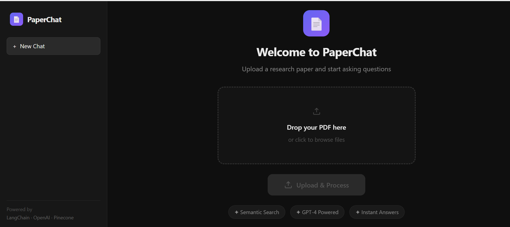
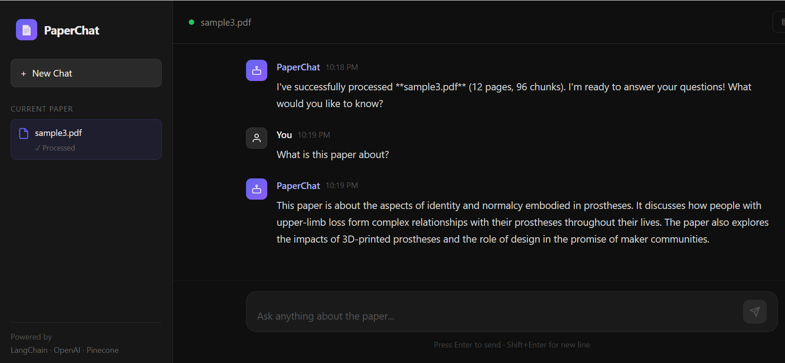

# 📄 PaperChat

> Chat with your research papers using AI. Upload any PDF and ask questions in natural language — powered by RAG, LangChain, OpenAI GPT-4, and Pinecone.

[](https://paperchat-bixg7nbyg-merub-shaikhs-projects.vercel.app/)
[](https://typescriptlang.org)
[](https://nextjs.org)
[](https://openai.com)
[](https://pinecone.io)

---

## 📌 Overview

PaperChat is a full-stack RAG (Retrieval-Augmented Generation) application that allows users to upload research papers and ask questions about them in natural language. Instead of reading through pages of dense academic text, users can get instant, accurate answers grounded in the paper's content.

Built as part of a research project at **Illinois Institute of Technology**, where qualitative research on assistive technology and mobility aids informed the design of accessible, user-centered interfaces.

---

## ✨ Features

- **📤 Drag & Drop Upload** — Upload any PDF research paper instantly
- **🧠 Semantic Search** — Finds relevant sections by meaning, not just keywords
- **💬 Conversational Q&A** — Ask questions in natural language
- **⚡ Fast Retrieval** — Sub-second responses using Pinecone vector database
- **🎯 Context-Aware** — GPT-4 answers grounded in your specific document
- **🌙 Dark Mode UI** — Modern ChatGPT-like interface
- **📱 Responsive Design** — Works on desktop and mobile
- **🔒 Secure** — Files processed in memory, not stored permanently

---

## 🖥️ Screenshots

### Upload Screen


### Chat Interface



---

## 🏗️ How It Works

PaperChat uses a **RAG (Retrieval-Augmented Generation)** pipeline:

```
📄 PDF Upload
     ↓
📝 Text Extraction       (LangChain PDFLoader)
     ↓
✂️  Chunking             (RecursiveCharacterTextSplitter)
     ↓                    chunk_size=1000, overlap=200
🔢 Embedding Generation  (OpenAI text-embedding-ada-002)
     ↓                    1536-dimensional vectors
🗄️  Vector Storage       (Pinecone - namespace per document)
     ↓
❓ User asks question
     ↓
🔍 Semantic Search       (Pinecone similarity search - top 3 chunks)
     ↓
🤖 Answer Generation     (GPT-4 + retrieved context)
     ↓
💡 Answer returned to user
```

---

## 🛠️ Tech Stack

| Category | Technology |
|----------|-----------|
| **Framework** | Next.js 15 (App Router) |
| **Language** | TypeScript |
| **AI Framework** | LangChain.js 0.3.x |
| **LLM** | OpenAI GPT-4 |
| **Embeddings** | OpenAI text-embedding-ada-002 (1536 dims) |
| **Vector Database** | Pinecone |
| **Styling** | Custom CSS (Dark Mode) |
| **Deployment** | Vercel (Serverless) |

---

## 🚀 Getting Started

### Prerequisites

- Node.js 18+
- OpenAI API Key → [Get one here](https://platform.openai.com/api-keys)
- Pinecone API Key → [Get one here](https://app.pinecone.io)

---

### 1. Clone the Repository

```bash
git clone https://github.com/MerubS/PaperChat.git
cd PaperChat
```

### 2. Install Dependencies

```bash
npm install --legacy-peer-deps
```

### 3. Set Up Environment Variables

Create a `.env` file in the root directory:

```env
OPENAI_API_KEY=sk-your-openai-api-key-here
PINECONE_API_KEY=your-pinecone-api-key-here
PINECONE_INDEX_NAME=paperchat
```

### 4. Set Up Pinecone Index

1. Go to [app.pinecone.io](https://app.pinecone.io)
2. Click **Create Index**
3. Use these settings:

```
Name:        paperchat
Dimensions:  1536
Metric:      cosine
Vector Type: Dense
```

### 5. Run the Development Server

```bash
npm run dev
```

Open [http://localhost:3000](http://localhost:3000)

---

## 📁 Project Structure

```
PaperChat/
├── public/
│   └── screenshots/          # README screenshots
├── src/
│   ├── app/
│   │   ├── api/
│   │   │   ├── upload/
│   │   │   │   └── route.ts  # PDF upload & processing endpoint
│   │   │   └── query/
│   │   │       └── route.ts  # Question answering endpoint
│   │   ├── globals.css       # Global dark mode styles
│   │   ├── layout.tsx        # Root layout
│   │   └── page.tsx          # Main chat UI
│   ├── lib/
│   │   └── rag.ts            # Core RAG logic (LangChain + Pinecone)
│   └── test.ts               # Backend test script
├── .env                      # Environment variables (not committed)
├── .gitignore
├── next.config.js
├── package.json
└── tsconfig.json
```

---

## 🔌 API Endpoints

### `POST /api/upload`

Uploads and processes a PDF file into vector embeddings.

**Request:**
```
Content-Type: multipart/form-data
Body: { file: File (PDF, max 10MB) }
```

**Response:**
```json
{
  "success": true,
  "documentId": "550e8400-e29b-41d4-a716-446655440000",
  "chunks": 25,
  "pages": 10
}
```

---

### `POST /api/query`

Queries the document and returns an AI-generated answer.

**Request:**
```json
{
  "question": "What is this paper about?",
  "documentId": "550e8400-e29b-41d4-a716-446655440000"
}
```

**Response:**
```json
{
  "success": true,
  "answer": "This paper examines...",
  "question": "What is this paper about?",
  "sources": [
    {
      "preview": "Relevant excerpt from the paper...",
      "page": 3
    }
  ]
}
```

---

## ⚙️ Configuration

Customize the RAG pipeline in `src/lib/rag.ts`:

```typescript
// Chunking settings
const splitter = new RecursiveCharacterTextSplitter({
  chunkSize: 1000,    // Increase for more context per chunk
  chunkOverlap: 200,  // Overlap to prevent cutting ideas mid-sentence
});

// Retrieval settings
const retriever = vectorStore.asRetriever({
  k: 3,              // Number of relevant chunks to retrieve
});

// LLM settings
const model = new ChatOpenAI({
  modelName: "gpt-4",      // Switch to "gpt-3.5-turbo" to reduce cost
  temperature: 0,           // 0 = deterministic answers
});
```

---

## 🚢 Deployment

### Deploy to Vercel

1. Push your code to GitHub
2. Import repo at [vercel.com](https://vercel.com)
3. Add environment variables:

```
OPENAI_API_KEY=sk-...
PINECONE_API_KEY=...
PINECONE_INDEX_NAME=paperchat
```

4. Click **Deploy** — done in under 2 minutes!

[](https://vercel.com/new/clone?repository-url=https://github.com/MerubS/PaperChat)

---

## 🤔 Why RAG?

Traditional LLMs can only answer based on their training data. RAG solves this by:

| Without RAG | With RAG (PaperChat) |
|-------------|---------------------|
| ❌ Can't read your specific paper | ✅ Reads and understands your paper |
| ❌ May hallucinate facts | ✅ Answers grounded in document |
| ❌ No source citations | ✅ Shows which section the answer came from |
| ❌ Limited to training data | ✅ Works with any document |

---

## 🛣️ Roadmap

- [ ] Multi-document support (query across multiple papers)
- [ ] Chat history persistence
- [ ] Source highlighting (show exact paragraph in PDF)
- [ ] Export conversation as PDF
- [ ] Support for other file formats (DOCX, TXT)
- [ ] Streaming responses

---

## 🤝 Contributing

Contributions are welcome!

1. Fork the repository
2. Create your feature branch (`git checkout -b feature/NewFeature`)
3. Commit your changes (`git commit -m 'Add NewFeature'`)
4. Push to the branch (`git push origin feature/NewFeature`)
5. Open a Pull Request

---

## 👤 Author

**Merub Shaikh**

[](https://www.linkedin.com/in/merub-shaikh/)
[](https://github.com/MerubS)
[](mailto:merubnshaikh@gmail.com)

---

## 🙏 Acknowledgments

- [LangChain](https://langchain.com) — AI orchestration framework
- [OpenAI](https://openai.com) — GPT-4 and embeddings API
- [Pinecone](https://pinecone.io) — Vector database
- [Next.js](https://nextjs.org) — React framework
- [Vercel](https://vercel.com) — Deployment platform

---

<div align="center">
  <p>If you found this project helpful, please consider giving it a ⭐</p>
  <p>Built with ❤️ by <a href="https://github.com/MerubS">Merub Shaikh</a></p>
</div>
